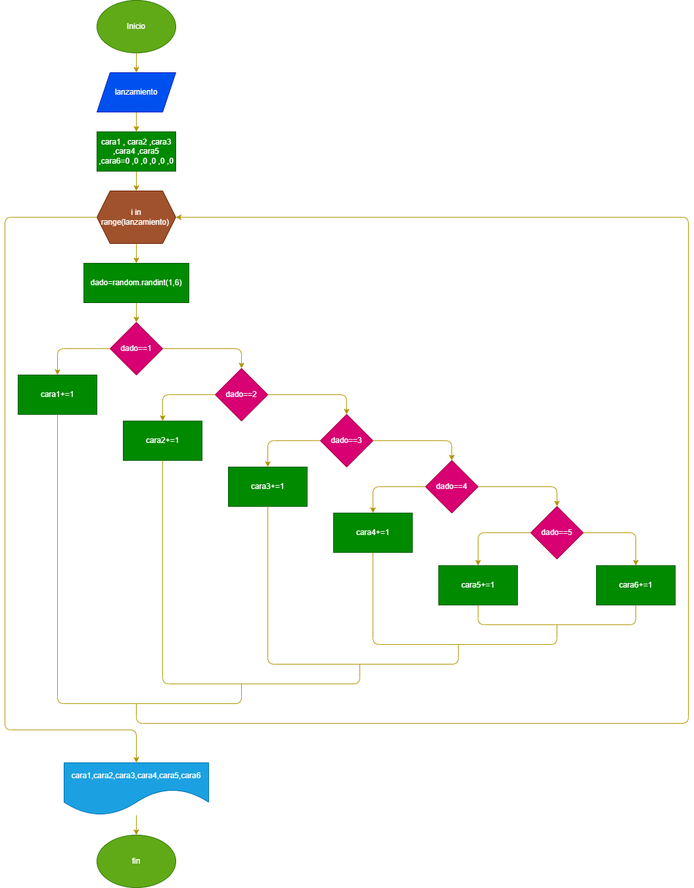

# Ejercicios del bucle for
1. Leer n número enteros mostrar cuantos son pares e impares
# SOLUCIÓN

## Diseño
### Diagrama de Flujo 

2. Mostrar e inprimir cuantos multiplos de 7 y cuantos multiplos de 9 hay entre mil y 5000
# SOLUCIÓN

## Diseño
### Diagrama de Flujo 

3. simular el lanzamiento de n dados, e imprimir cuantas veces cayo cada cara . mostrar resultado con barras y asteriscos 
# SOLUCIÓN

## Diseño
### Diagrama de Flujo 

4. calcular y mostrar el factorial de un número  
# SOLUCIÓN

## Diseño
### Diagrama de Flujo 
